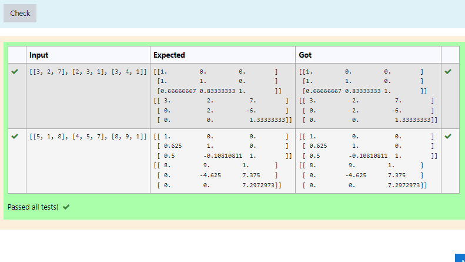
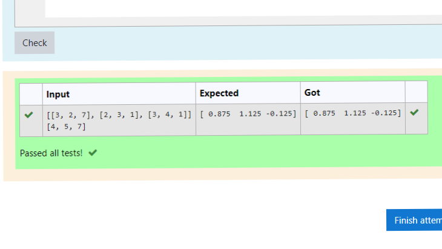

# LU Decomposition without zero on the diagonal

## AIM:
To write a program to find the LU Decomposition of a matrix.

## Equipments Required:
1. Hardware – PCs
2. Anaconda – Python 3.7 Installation / Moodle-Code Runner

## Algorithm
1. Import numpy as np
2. from scipy.linalg import lu
3. declare the matrix to a variable A
4. declare P,L,U to A
5. Print L and U of matrix a

## Program:
```
/*
Program to find the LU Decomposition of a matrix.
Developed by: Dharshini D.S
RegisterNumber: 21500154
# To print L and U matrix
import numpy as np
from scipy.linalg import lu
#import scipy
A=np.array(eval(input()))
P,L,U=lu(A)
#P,L,U=scipy.linalg.lu(A)
print(L)
print(U)

*/
```

## Output:



## Result:
Thus the program to find the LU Decomposition of a matrix is written and verified using python programming.


# LU Decomposition without zero on the diagonal

## AIM:
To write a program to find the LU Decomposition of a matrix.

## Equipments Required:
1. Hardware – PCs
2. Anaconda – Python 3.7 Installation / Moodle-Code Runner

## Algorithm
1. Import numpy as np
2. from scipy.linalg import lu_factor,lu_solve
3. Assign the values of A and B
4. declare lu_pivot to lu_factor of A
5. Assign x to lu_solve of lu_factor A
6. Print(x)

## Program:
```
/*
Program to find the LU Decomposition of a matrix.
Developed by: Dharshini D.S
RegisterNumber: 21500154
# To print X matrix (solution to the equations)
import numpy as np
from scipy.linalg import lu_factor, lu_solve
A=np.array(eval(input()))
B=np.array(eval(input()))
lu, pivot= lu_factor(A)
x=lu_solve((lu,pivot),B)
print(x)

*/
```

## Output:



## Result:
Thus the program to find the LU Decomposition of a matrix is written and verified using python programming.
